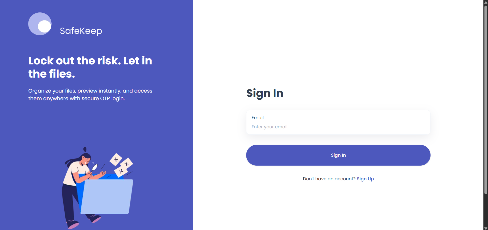
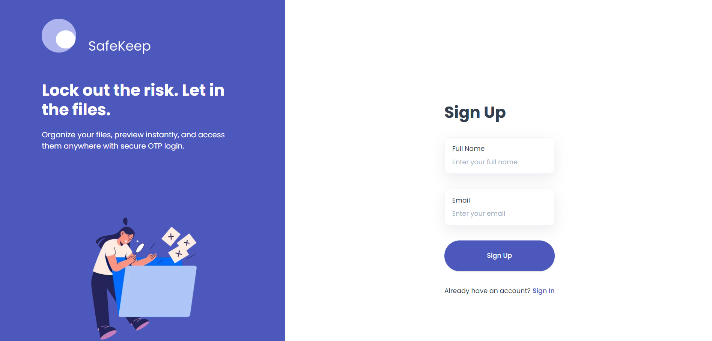
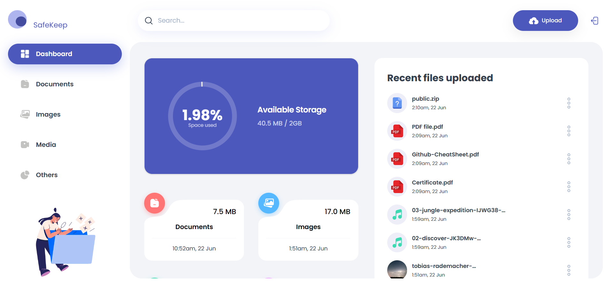
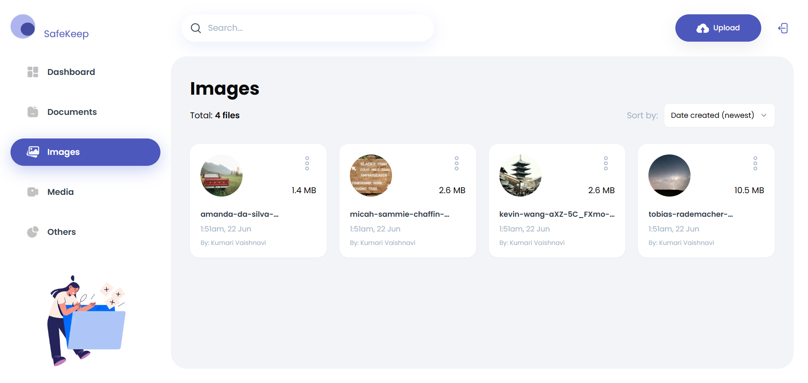
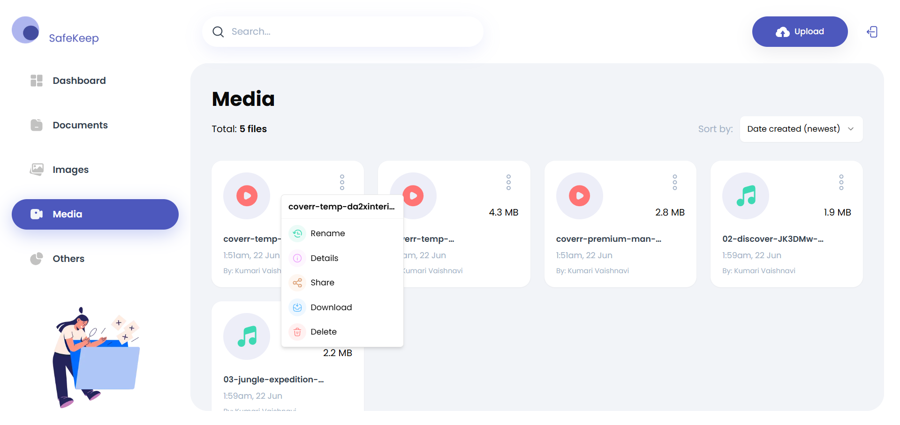

# 📁 SafeKeep

**SafeKeep** is a secure, responsive file storage platform built with Next.js, Tailwind CSS, Appwrite, and TypeScript. It allows users to upload, preview, manage, and share files with ease — all while ensuring privacy and performance.

---

## 🚀 Features

- 🔒 Passwordless OTP authentication
- 📦 Upload & preview documents, images, videos, audio
- 📜 Rename, delete, download, and share files
- 🕒 View recent uploads with timestamps
- 📱 Fully responsive, mobile-first design
- 🧠 File type-based thumbnail system
- 🍪 Session persistence using cookies
- 🎛️ Action dropdown for file-level operations

---

## 🛠️ Tech Stack

- **Framework**: Next.js 14+ with App Router
- **Styling**: Tailwind CSS + ShadCN UI
- **Backend**: Appwrite (Database, Auth, Storage)
- **Language**: TypeScript
- **State**: Server Actions + React Context
- **Auth**: Email OTP (no password)
- **UI**: Responsive with mobile-first layout

---

## 📷 Screenshots
 
 
 
 

 
---

## 📦 Setup Instructions

### 1. Clone the repository

```bash
git clone https://github.com/your-username/safekeep.git
cd safekeep
```

### 2. Install dependencies

```bash
npm install
```

### 3. Setup .env.local
```bash
NEXT_PUBLIC_APPWRITE_ENDPOINT=https://your-appwrite-endpoint
NEXT_PUBLIC_APPWRITE_PROJECT=your-project-id
NEXT_APPWRITE_SECRET=your-secret-key
NEXT_PUBLIC_APPWRITE_DATABASE=your-database-id
NEXT_PUBLIC_APPWRITE_USERS_COLLECTION=users
NEXT_PUBLIC_APPWRITE_FILES_COLLECTION=files
NEXT_PUBLIC_APPWRITE_BUCKET=bucket
```

### 4. Run the dev server
```bash
npm run dev
```
### 🧪 Appwrite Setup
Ensure the following in your Appwrite Console:

- Email OTP enabled

- Database with users and files collections

- Storage bucket created

- Proper read/write permissions for users

